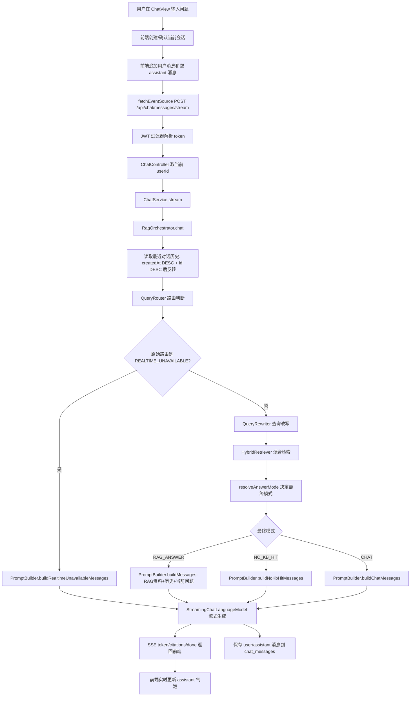

# 用户提问到回答输出链路

本文梳理当前项目中，用户在前端输入问题后，到后端路由、检索、生成、流式返回并持久化消息的完整逻辑。内容基于当前代码实现。

## 1. 总览



## 2. 资料入库前置流程

问答能检索到资料，依赖用户先完成文档上传和入库。

1. 前端上传文件到 `POST /api/documents/upload`。
2. `DocumentController` 从 `SecurityUtils.getCurrentUserId()` 取得当前用户 ID。
3. `DocumentService.upload` 校验文件类型，只支持 `pdf`、`txt`、`md`、`markdown`。
4. 文件原文保存到 MinIO，文档元数据写入 `documents` 表，状态为 `processing`。
5. `DocumentParserDispatcher` 解析全文：PDF 使用 LangChain4j `ApachePdfBoxDocumentParser`，TXT/Markdown 按 UTF-8 读取。
6. `ChunkService` 按配置切块：默认 `RECURSIVE`，配置为 `rag.chunk.size=800`、`overlap=80`；Markdown 可用 `BY_HEADING`。
7. 切块结果先写入 Redis 预览态，用户可调整切块参数。
8. 用户确认入库后调用 `POST /api/documents/{id}/confirm-ingest`。
9. `DocumentService.confirmIngestAsync` 异步执行：写入 `document_chunks`，调用 DashScope embedding 批量向量化，写入 Milvus，并将文档状态更新为 `completed`。
10. 每个 `TextSegment` metadata 包含 `userId`、`documentId`、`documentName`、`documentType`、`chunkIndex`、`title`、`keywords`，用于数据隔离、检索和引用溯源。

## 3. 前端提问流程

入口文件：`iflyzcragvue/src/views/ChatView.vue`

1. 用户输入问题并点击发送，或按回车触发 `handleSend`。
2. 如果当前没有 `activeSessionId`，先调用 `chatStore.createSession()` 创建会话。
3. 前端立即把用户消息加入 `activeMessages`，让页面先显示用户问题。
4. 同时追加一条空的 assistant 消息，用于承接后续流式 token。
5. 从 `localStorage` 读取 `token`，通过 `fetchEventSource` 请求：

```text
POST http://localhost:8080/api/chat/messages/stream
Authorization: Bearer <token>
Content-Type: application/json

{
  "sessionId": "<当前会话 ID>",
  "query": "<用户问题>"
}
```

6. 前端监听 SSE 事件：
   - `token`：拼接到 assistant 消息内容，形成打字机效果。
   - `citations`：解析引用列表并挂到消息上。
   - `done`：读取 `answerMode`、`confidence`、`routeReason`，结束发送状态。
   - `error`：提示“对话失败”。

会话列表、历史消息加载走 `iflyzcragvue/src/api/chat.ts` 的 Axios 封装；流式问答目前直接在 `ChatView.vue` 中使用 `fetchEventSource`。

## 4. 后端鉴权与入口

入口文件：`iflyzcragback/src/main/java/com/zc/iflyzcragback/controller/ChatController.java`

1. `SecurityConfig` 要求除 `/api/auth/login` 和 `/api/auth/register` 外，其余接口必须认证。
2. `JwtAuthenticationFilter` 从 `Authorization: Bearer <token>` 解析 JWT，并把当前用户放入 Spring Security 上下文。
3. `ChatController.stream` 校验 `ChatRequest`：`sessionId` 和 `query` 不能为空。
4. 控制器通过 `SecurityUtils.getCurrentUserId()` 取得当前用户 ID。
5. 调用 `ChatService.stream(sessionId, query, userId)`。
6. `ChatService` 当前只做转发，实际逻辑进入 `RagOrchestrator.chat`。

## 5. RAG 主流程

核心文件：`iflyzcragback/src/main/java/com/zc/iflyzcragback/service/rag/RagOrchestrator.java`

### 5.1 创建 SSE 通道

`RagOrchestrator.chat` 创建 `SseEmitter(60_000L)`，并启动新线程异步处理问答。后续生成 token、引用和完成信号都通过这个 emitter 返回。

### 5.2 读取历史对话

从 `chat_messages` 中按 `sessionId` 查询最近 `rag.history.max-turns * 2` 条消息。当前配置 `max-turns=4`，即最多取 4 轮用户/助手历史。

查询排序为：

```text
createdAt DESC + id DESC
```

取到最近消息后复制为可变列表，再 `Collections.reverse(history)`，确保最终传入 Router、QueryRewriter 和 PromptBuilder 的历史顺序稳定为：

```text
createdAt ASC + id ASC
```

也就是自然对话顺序：`user -> assistant -> user -> assistant`。

注意：这里当前按 `sessionId` 查历史，没有在查询条件中额外校验 `userId`；入口处使用当前用户 ID 做后续检索隔离，但会话归属校验主要由会话相关接口承担。

### 5.3 QueryRouter 路由判断

文件：`QueryRouter.java`

Router 输出 `QueryRoute`：

| 路由 | 含义 |
| --- | --- |
| `CHAT` | 确定是普通对话，不需要知识库依据 |
| `KB_QA` | 需要根据知识库、文档、资料回答 |
| `REALTIME_UNAVAILABLE` | 需要实时外部数据，但当前系统没有实时查询能力 |
| `UNCLEAR` | 无法判断 |

Router prompt 的核心规则：

- 优先根据当前“用户问题”判断路由。
- 路由上下文只用于补全代词、省略或承接问题。
- 如果当前问题本身语义完整，不要继承历史主题。
- 事实查询、列表查询、方案查询、上下文不确定的问题，不要选 `CHAT`；能判断为知识库问题就选 `KB_QA`，否则选 `UNCLEAR`。

### 5.4 路由上下文

Router 不直接接收完整历史消息，而是使用 `formatRoutingContext(history)` 构造路由专用上下文。

当前规则：

1. 最多查看最近 6 条历史消息。
2. `user` 消息保留内容，但会压缩空白并截断到 120 字符。
3. `assistant` 消息不保留正文，只保留 `assistant_answer_mode`。
4. 如果没有可用上下文，输出 `(无)`。

示例：

```text
user: 你好
assistant_answer_mode: CHAT
user: 今天白银的价格是多少
assistant_answer_mode: REALTIME_UNAVAILABLE
user: 题库都有哪些平台有
```

这样既保留追问消歧能力，又避免把上一轮 assistant 长回答带偏 Router。

### 5.5 实时数据问题短路

如果 `QueryRouter` 原始路由为 `REALTIME_UNAVAILABLE`：

1. 不执行查询改写。
2. 不执行知识库检索。
3. 调用 `PromptBuilder.buildRealtimeUnavailableMessages(query, history)`。
4. 通过 LLM 生成“当前不能提供实时外部数据”的受控回复。
5. 最终 `answerMode=REALTIME_UNAVAILABLE`。

典型问题：

```text
今天白银价格是多少
现在天气怎么样
当前股票行情
```

### 5.6 查询改写

文件：`QueryRewriter.java`

1. 读取配置 `rag.query-rewrite.enabled` 和 `rag.query-rewrite.min-query-length`。
2. 当前配置启用改写，最小长度为 15。
3. 如果问题太短、改写模型不可用或改写失败，则直接返回原问题。
4. 如果满足条件，则使用 `ChatLanguageModel` 基于最近历史把问题改写为 3 个语义等价查询。
5. 最终查询列表始终包含原始 query，并去重。

因此日志中：

```text
queries=1
```

通常表示本次只使用原始 query，常见原因是问题长度小于 `min-query-length=15`。

### 5.7 混合检索

文件：`HybridRetriever.java`

对每个 query 执行两路检索：

1. 向量检索：`VectorRetriever.search(q, userId, topK)`。
2. BM25 检索：`DocumentChunkMapper.bm25Search(q, userId, topK)`。

两路结果使用 RRF 融合：

```text
score = sum(1 / (rrfK + rank))
```

当前配置：

- `rag.retrieval.top-k=10`
- `rag.retrieval.min-score=0.6`
- `rag.retrieval.rrf-k=60`
- `rag.retrieval.rerank-top-k=3` 目前配置存在，但主链路未实际调用 reranker。

日志字段含义：

```text
queries          本次参与检索的 query 数量
candidates       向量检索 + BM25 合并后的候选 chunk 数
returned         RRF 排序后返回给后续流程的 chunk 数
topVectorScore   向量检索最高相似度；若向量无命中则为 0.0
```

### 5.8 向量检索与数据隔离

文件：`VectorRetriever.java`

1. `EmbeddingService` 将 query 转为向量。
2. 构造 `EmbeddingSearchRequest`：
   - `maxResults=topK`
   - `minScore=rag.retrieval.min-score`
   - `filter=metadataKey("userId").isEqualTo(userId.toString())`
3. 调用 Milvus `embeddingStore.search(request)`。
4. 日志记录 `userId`、query、命中数和最高分。

这里满足 RAG 指南中的关键要求：检索必须带 `userId` metadata 过滤，并使用最低相似度阈值。

### 5.9 BM25 检索与数据隔离

文件：`DocumentChunkMapper.java`

BM25 使用 MySQL FULLTEXT：

- 从 `document_chunks` 查询。
- 条件包含 `c.user_id = #{userId}`。
- 条件包含 `c.deleted = 0`。
- 通过 `MATCH(c.content) AGAINST(...)` 计算分数。
- JOIN `documents` 带回文档名，用于 prompt 来源和 citations。

### 5.10 最终 answerMode 决策

文件：`RagOrchestrator.resolveAnswerMode`

除 `REALTIME_UNAVAILABLE` 已提前短路外，系统会根据原始路由和本次检索结果决定最终模式。

| 原始路由 | 检索结果 | 最终模式 |
| --- | --- | --- |
| `CHAT` | `decision.confidence < rag.routing.strong-chat-confidence` 且 `topVectorScore >= rag.routing.chat-override-min-score` 且有 chunk | `RAG_ANSWER` |
| `CHAT` | 未满足强证据门槛 | `CHAT` |
| `KB_QA` / `UNCLEAR` | 有 chunk | `RAG_ANSWER` |
| `KB_QA` / `UNCLEAR` | 无 chunk | `NO_KB_HIT` |
| `REALTIME_UNAVAILABLE` | 不检索 | `REALTIME_UNAVAILABLE` |

当前配置：

```yaml
rag:
  routing:
    chat-override-min-score: 0.72
    strong-chat-confidence: 0.95
```

这套规则的目的：

- `CHAT` 不再一票否决知识库。
- 只有高质量向量证据才能把 `CHAT` 覆盖成 `RAG_ANSWER`。
- 只有 BM25 命中但 `topVectorScore=0` 时，不会把 `CHAT` 覆盖成 RAG，避免“你好”等弱相关问题误走知识库。

路由决策日志示例：

```text
路由决策完成 | 原始路由=KB_QA | 最终模式=RAG_ANSWER | 命中数=3 | 最高向量分数=0.7622518539428711 | 是否触发CHAT覆盖=false
```

### 5.11 各模式 Prompt 构造

文件：`PromptBuilder.java`

#### RAG_ANSWER

调用 `buildMessages(query, chunks, history)`。

消息结构：

1. `SystemMessage`：包含 RAG 规则和参考资料。
2. 历史中的 `user` / `assistant` 消息。
3. 当前用户问题。

RAG 规则要求：

- 仅基于参考资料回答。
- 每个论述标注 `[来源 N]`。
- 资料不足时明确回答“根据现有知识库，我无法回答这个问题。”
- 使用中文，结构清晰。

参考资料按 chunk 渲染为：

```text
[来源 1] (文档：xxx "标题")
<chunk 内容>
```

#### NO_KB_HIT

调用 `buildNoKbHitMessages(query, history)`。

含义：问题看起来需要知识库回答，或 Router 不确定，但当前知识库没有检索到可靠依据。

系统会要求模型：

- 明确说明当前知识库没有足够依据。
- 不编造事实、数字、价格、日期。
- 不声称查询了外部网站或实时数据。
- 可建议用户上传相关文档或启用外部数据插件。

#### CHAT

调用 `buildChatMessages(query, history)`。

含义：普通对话，或原始路由为 `CHAT` 且没有强知识库证据。

系统会要求模型：

- 处理问候、感谢、身份介绍、能力说明、使用引导。
- 不回答需要知识库依据的业务事实、文档内容或专业结论。
- 不编造资料、价格、实时信息、政策条款、文档内容。

#### REALTIME_UNAVAILABLE

调用 `buildRealtimeUnavailableMessages(query, history)`。

含义：用户问题需要实时外部数据，但当前系统没有实时查询能力。

系统会要求模型：

- 明确说明当前不能提供实时外部数据。
- 不给出具体实时价格、行情、天气、新闻、汇率、股票现价。
- 不声称已经查询外部网站或实时数据。

### 5.12 流式生成

`RagOrchestrator` 使用 LangChain4j `StreamingChatLanguageModel`：

1. `onPartialResponse` 每收到一个 token：
   - 追加到 `answerBuilder`。
   - 通过 SSE `token` 发给前端。
2. `onCompleteResponse` 完成后：
   - 如果本轮有 RAG chunks，构造 `CitationVO` 并发送 SSE `citations`。
   - 发送 SSE `done`，数据中包含 `answerMode`、`confidence`、`routeReason`。
   - 保存消息到数据库。
3. `onError`：
   - 记录日志。
   - 发送 SSE `error`。
   - 结束 emitter。

### 5.13 消息保存

`RagOrchestrator.saveMessage` 会写入两条记录：

1. `role=user`，内容为原始 query。
2. `role=assistant`，内容为完整 answer，并记录：
   - `confidence`
   - `answerMode`
   - `responseTime`

`answerMode` 会参与下一轮 Router 的路由上下文，但 assistant 正文不会进入 Router 上下文。

## 6. 输出与前端展示

### 6.1 SSE 输出

后端会发送：

| 事件 | 含义 |
| --- | --- |
| `token` | LLM 增量输出文本 |
| `citations` | RAG 命中时的结构化引用列表 |
| `done` | 本轮完成，包含 `answerMode`、`confidence`、`routeReason` |
| `error` | 生成或 SSE 异常 |

### 6.2 前端展示

前端收到 `token` 后会不断更新刚才创建的 assistant 空消息，因此页面表现为流式输出。

当前聊天气泡会根据 `answerMode` 显示不同标签，例如：

- `CHAT`：普通对话
- `RAG_ANSWER`：知识库回答
- `NO_KB_HIT`：未命中知识库
- `REALTIME_UNAVAILABLE`：需要实时数据

前端 store 中会保存 `citations` 和 `confidence`，页面可展示引用来源和可信度。

## 7. 当前主链路中的未接入点

以下能力在配置或实体字段中有痕迹，但当前用户提问到回答的主链路未实际调用：

- 插件机制：未看到 `Plugin` 实现或 before/after RAG 调用。
- 技能机制：`chat_messages` 有 `skillUsed` 字段，但主链路未做技能识别或状态机处理。
- Reranker：`rag.rerank` 和 `retrieval.rerank-top-k` 有配置，但 `HybridRetriever` 只做 RRF 后取 topK，未进入二次精排。
- 答案 grounding 验证：当前 prompt 要求引用，但生成后没有独立 verifier 检查答案是否完全基于参考资料。
- Golden Dataset：当前还没有正式评估集来验证 Recall@K / MRR / Faithfulness。

## 8. 关键日志解释

### 混合检索日志

```text
混合检索完成: userId=1, queries=1, candidates=3, returned=3, topVectorScore=0.7622518539428711
```

含义：

- `queries=1`：本次只使用原始 query，通常是问题长度低于查询改写阈值。
- `candidates=3`：向量和 BM25 合并后有 3 个候选 chunk。
- `returned=3`：最终返回 3 个 chunk。
- `topVectorScore=0.762...`：最高向量相似度。

### 路由决策日志

```text
路由决策完成 | 原始路由=KB_QA | 最终模式=RAG_ANSWER | 命中数=3 | 最高向量分数=0.7622518539428711 | 是否触发CHAT覆盖=false
```

含义：

- Router 原始判断是知识库问答。
- 检索命中 3 个片段。
- 最终走 `RAG_ANSWER`。
- 这次不是 `CHAT` 被强证据覆盖，所以 `是否触发CHAT覆盖=false`。

## 9. 关键文件索引

| 环节 | 文件 |
| --- | --- |
| 聊天页面 | `iflyzcragvue/src/views/ChatView.vue` |
| 聊天状态 | `iflyzcragvue/src/stores/chat.ts` |
| 聊天 API | `iflyzcragvue/src/api/chat.ts` |
| HTTP 鉴权拦截 | `iflyzcragvue/src/api/http.ts` |
| 后端聊天入口 | `iflyzcragback/src/main/java/com/zc/iflyzcragback/controller/ChatController.java` |
| 聊天转发服务 | `iflyzcragback/src/main/java/com/zc/iflyzcragback/service/ChatService.java` |
| RAG 编排 | `iflyzcragback/src/main/java/com/zc/iflyzcragback/service/rag/RagOrchestrator.java` |
| 路由判断 | `iflyzcragback/src/main/java/com/zc/iflyzcragback/service/rag/QueryRouter.java` |
| 查询改写 | `iflyzcragback/src/main/java/com/zc/iflyzcragback/service/rag/QueryRewriter.java` |
| 混合检索 | `iflyzcragback/src/main/java/com/zc/iflyzcragback/service/rag/HybridRetriever.java` |
| 向量检索 | `iflyzcragback/src/main/java/com/zc/iflyzcragback/service/rag/VectorRetriever.java` |
| Prompt 构造 | `iflyzcragback/src/main/java/com/zc/iflyzcragback/service/rag/PromptBuilder.java` |
| 文档上传入库 | `iflyzcragback/src/main/java/com/zc/iflyzcragback/service/document/DocumentService.java` |
| 文档切块 | `iflyzcragback/src/main/java/com/zc/iflyzcragback/service/document/ChunkService.java` |
| BM25 SQL | `iflyzcragback/src/main/java/com/zc/iflyzcragback/mapper/DocumentChunkMapper.java` |
| RAG 配置 | `iflyzcragback/src/main/resources/application.yml` |

## 10. RAG 指南核对

- 已按要求先阅读 `文档/RAG工程化准确率提升指南.md`。
- 当前检索实现包含 `userId` 隔离：向量检索使用 Milvus metadata filter，BM25 使用 `c.user_id = #{userId}`。
- 当前向量检索包含 `minScore`，但项目配置为 `0.6`，低于指南建议默认值 `0.65`。
- Prompt 要求回答带 `[来源 N]`，后端也返回结构化 `citations`。
- 当前已增加路由决策日志，包含原始路由、最终模式、命中数、最高向量分数、CHAT 覆盖状态。
- 当前缺少生成后 grounding 验证、Golden Dataset 评估和 reranker 接入，属于后续优化点。
