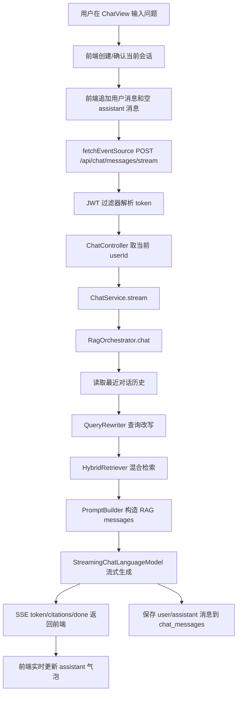

# 用户提问到回答输出链路

本文梳理当前项目中，用户在前端输入问题后，到后端检索、生成、流式返回并持久化消息的完整逻辑。内容基于当前代码实现。

## 1. 总览



## 2. 资料入库前置流程

问答能检索到资料，依赖用户先完成文档上传和入库。

1. 前端上传文件到 `POST /api/documents/upload`。
2. `DocumentController` 从 `SecurityUtils.getCurrentUserId()` 取得当前用户 ID。
3. `DocumentService.upload` 校验文件类型，只支持 `pdf`、`txt`、`md`、`markdown`。
4. 文件原文保存到 MinIO，文档元数据写入 `documents` 表，状态为 `processing`。
5. `DocumentParserDispatcher` 解析全文：
   - PDF 使用 LangChain4j `ApachePdfBoxDocumentParser`。
   - TXT/Markdown 按 UTF-8 读取。
6. `ChunkService` 按配置切块：
   - 默认 `RECURSIVE`，配置为 `rag.chunk.size=800`、`overlap=80`。
   - Markdown 可用 `BY_HEADING` 按标题粗切，再递归细切。
   - 每个 chunk 会提取标题和关键词。
7. 切块结果先写入 Redis 预览态，用户可调整切块参数。
8. 用户确认入库后调用 `POST /api/documents/{id}/confirm-ingest`。
9. `DocumentService.confirmIngestAsync` 异步执行：
   - 将 chunk 写入 `document_chunks`。
   - 调用 DashScope embedding 模型批量向量化。
   - 将向量和 `TextSegment` 写入 Milvus。
   - metadata 包含 `userId`、`documentId`、`documentName`、`documentType`、`chunkIndex`、`title`、`keywords`。
   - 更新文档状态为 `completed`，记录 `chunkCount` 和 `embeddingVersion`。

## 3. 前端提问流程

入口文件：`iflyzcragvue/src/views/ChatView.vue`

1. 用户输入问题并点击发送，或按回车触发 `handleSend`。
2. 如果当前没有 `activeSessionId`，先调用 `chatStore.createSession()` 创建会话。
3. 前端立即把用户消息加入 `activeMessages`，让页面先显示用户问题。
4. 同时追加一条空的 assistant 消息，用于承接后续流式 token。
5. 从 `localStorage` 读取 `token`，通过 `fetchEventSource` 请求：

```text
POST http://localhost:8080/api/chat/messages/stream
Authorization: Bearer <token>
Content-Type: application/json

{
  "sessionId": "<当前会话 ID>",
  "query": "<用户问题>"
}
```

6. 前端监听 SSE 事件：
   - `token`：拼接到 assistant 消息内容，形成打字机效果。
   - `citations`：解析引用列表并挂到消息上。
   - `done`：读取 `confidence`，结束发送状态。
   - `error`：提示“对话失败”。

会话列表、历史消息加载走 `iflyzcragvue/src/api/chat.ts` 的 Axios 封装；流式问答目前直接在 `ChatView.vue` 中使用 `fetchEventSource`。

## 4. 后端鉴权与入口

入口文件：`iflyzcragback/src/main/java/com/zc/iflyzcragback/controller/ChatController.java`

1. `SecurityConfig` 要求除 `/api/auth/login` 和 `/api/auth/register` 外，其余接口必须认证。
2. `JwtAuthenticationFilter` 从 `Authorization: Bearer <token>` 解析 JWT，并把当前用户放入 Spring Security 上下文。
3. `ChatController.stream` 校验 `ChatRequest`：
   - `sessionId` 不能为空。
   - `query` 不能为空。
4. 控制器通过 `SecurityUtils.getCurrentUserId()` 取得当前用户 ID。
5. 调用 `ChatService.stream(sessionId, query, userId)`。
6. `ChatService` 当前只做转发，实际逻辑进入 `RagOrchestrator.chat`。

## 5. RAG 主流程

核心文件：`iflyzcragback/src/main/java/com/zc/iflyzcragback/service/rag/RagOrchestrator.java`

### 5.1 创建 SSE 通道

`RagOrchestrator.chat` 创建 `SseEmitter(60_000L)`，并启动新线程异步处理问答。后续生成 token、引用和完成信号都通过这个 emitter 返回。

### 5.2 读取历史对话

从 `chat_messages` 中按 `sessionId` 查询最近 `rag.history.max-turns * 2` 条消息。当前配置 `max-turns=4`，即最多取 4 轮用户/助手历史。

注意：这里当前按 `sessionId` 查历史，没有在查询条件中额外校验 `userId`；入口处使用当前用户 ID 做后续检索隔离，但会话归属校验主要由会话相关接口承担。

### 5.3 查询改写

文件：`QueryRewriter.java`

1. 读取配置 `rag.query-rewrite.enabled` 和 `rag.query-rewrite.min-query-length`。
2. 当前配置启用改写，最小长度为 15。
3. 如果问题太短、改写模型不可用或改写失败，则直接返回原问题。
4. 如果满足条件，则使用 `ChatLanguageModel` 基于最近历史把问题改写为 3 个语义等价查询。
5. 最终查询列表始终包含原始 query，并去重。

### 5.4 混合检索

文件：`HybridRetriever.java`

对每个 query 执行两路检索：

1. 向量检索：`VectorRetriever.search(q, userId, topK)`。
2. BM25 检索：`DocumentChunkMapper.bm25Search(q, userId, topK)`。

两路结果使用 RRF 融合：

```text
score = sum(1 / (rrfK + rank))
```

当前配置：

- `rag.retrieval.top-k=10`
- `rag.retrieval.min-score=0.6`
- `rag.retrieval.rrf-k=60`
- `rag.retrieval.rerank-top-k=3` 目前配置存在，但主链路未实际调用 reranker。

### 5.5 向量检索与数据隔离

文件：`VectorRetriever.java`

1. `EmbeddingService` 将 query 转为向量。
2. 构造 `EmbeddingSearchRequest`：
   - `maxResults=topK`
   - `minScore=rag.retrieval.min-score`
   - `filter=metadataKey("userId").isEqualTo(userId.toString())`
3. 调用 Milvus `embeddingStore.search(request)`。
4. 日志记录 `userId`、query、命中数和最高分。

这里满足 RAG 指南中的关键要求：检索必须带 `userId` metadata 过滤，并使用最低相似度阈值。

### 5.6 BM25 检索与数据隔离

文件：`DocumentChunkMapper.java`

BM25 使用 MySQL FULLTEXT：

- 从 `document_chunks` 查询。
- 条件包含 `c.user_id = #{userId}`。
- 条件包含 `c.deleted = 0`。
- 通过 `MATCH(c.content) AGAINST(...)` 计算分数。
- JOIN `documents` 带回文档名，用于 prompt 来源和 citations。

### 5.7 无命中处理

如果融合后没有 chunk：

1. 后端通过 SSE `token` 返回固定回答：`根据现有知识库，我无法回答这个问题。`
2. 发送 `done` 事件。
3. 保存用户问题和 assistant 回答。
4. 结束 SSE。

当前没有调用 WebSearchPlugin 或其他兜底插件。

### 5.8 构造 Prompt

文件：`PromptBuilder.java`

构造 LangChain4j `ChatMessage` 列表：

1. 第一条是 `SystemMessage`，包含 RAG 规则和参考资料。
2. 规则要求：
   - 仅基于参考资料回答。
   - 每个论述标注 `[来源 N]`。
   - 资料不足时明确回答无法回答。
   - 使用中文，结构清晰。
3. 参考资料按 chunk 渲染为：

```text
[来源 1] (文档：xxx "标题")
<chunk 内容>
```

4. 追加历史中的 user/assistant 消息。
5. 最后追加当前用户问题。

### 5.9 流式生成

`RagOrchestrator` 使用 LangChain4j `StreamingChatLanguageModel`：

1. `onPartialResponse` 每收到一个 token：
   - 追加到 `answerBuilder`。
   - 通过 SSE `token` 发给前端。
2. `onCompleteResponse` 完成后：
   - 根据检索 chunks 构造 `CitationVO`。
   - 发送 SSE `citations`。
   - 发送 SSE `done`，数据中包含 `confidence`。
   - 保存消息到数据库。
3. `onError`：
   - 记录日志。
   - 发送 SSE `error`。
   - 结束 emitter。

## 6. 输出与持久化

### 6.1 前端展示

前端收到 `token` 后会不断更新刚才创建的 assistant 空消息，因此页面表现为流式输出。

当前模板只渲染 `msg.content`，虽然 store 中会保存 `citations` 和 `confidence`，页面暂未展示引用列表和置信度。

### 6.2 后端保存

`RagOrchestrator.saveMessage` 会写入两条记录：

1. `role=user`，内容为原始 query。
2. `role=assistant`，内容为完整 answer，并记录：
   - `confidence`
   - `responseTime`

历史消息接口 `GET /api/chat/sessions/{sessionId}/messages` 会从 `chat_messages` 读取并返回 `MessageVO`。当前 `SessionService.toMessageVO` 返回 `content`、`confidence`、`createdAt` 等字段，但没有从数据库恢复 citations。

## 7. 当前主链路中的未接入点

以下能力在配置或实体字段中有痕迹，但当前用户提问到回答的主链路未实际调用：

- 插件机制：未看到 `Plugin` 实现或 before/after RAG 调用。
- 技能机制：`chat_messages` 有 `skillUsed` 字段，但主链路未做技能识别或状态机处理。
- Reranker：`rag.rerank` 和 `retrieval.rerank-top-k` 有配置，但 `HybridRetriever` 只做 RRF 后取 topK，未进入二次精排。
- 答案 grounding 验证：当前 prompt 要求引用，但生成后没有独立 verifier 检查答案是否完全基于参考资料。
- 前端引用展示：SSE 已返回 `citations`，但聊天气泡 UI 暂未渲染引用列表。

## 8. 关键文件索引

| 环节 | 文件 |
| --- | --- |
| 聊天页面 | `iflyzcragvue/src/views/ChatView.vue` |
| 聊天状态 | `iflyzcragvue/src/stores/chat.ts` |
| 聊天 API | `iflyzcragvue/src/api/chat.ts` |
| HTTP 鉴权拦截 | `iflyzcragvue/src/api/http.ts` |
| 后端聊天入口 | `iflyzcragback/src/main/java/com/zc/iflyzcragback/controller/ChatController.java` |
| 聊天转发服务 | `iflyzcragback/src/main/java/com/zc/iflyzcragback/service/ChatService.java` |
| RAG 编排 | `iflyzcragback/src/main/java/com/zc/iflyzcragback/service/rag/RagOrchestrator.java` |
| 查询改写 | `iflyzcragback/src/main/java/com/zc/iflyzcragback/service/rag/QueryRewriter.java` |
| 混合检索 | `iflyzcragback/src/main/java/com/zc/iflyzcragback/service/rag/HybridRetriever.java` |
| 向量检索 | `iflyzcragback/src/main/java/com/zc/iflyzcragback/service/rag/VectorRetriever.java` |
| Prompt 构造 | `iflyzcragback/src/main/java/com/zc/iflyzcragback/service/rag/PromptBuilder.java` |
| 文档上传入库 | `iflyzcragback/src/main/java/com/zc/iflyzcragback/service/document/DocumentService.java` |
| 文档切块 | `iflyzcragback/src/main/java/com/zc/iflyzcragback/service/document/ChunkService.java` |
| BM25 SQL | `iflyzcragback/src/main/java/com/zc/iflyzcragback/mapper/DocumentChunkMapper.java` |
| RAG 配置 | `iflyzcragback/src/main/resources/application.yml` |

## 9. RAG 指南核对

- 已按要求先阅读 `文档/RAG工程化准确率提升指南.md`。
- 当前检索实现包含 `userId` 隔离：向量检索使用 Milvus metadata filter，BM25 使用 `c.user_id = #{userId}`。
- 当前向量检索包含 `minScore`，但项目配置为 `0.6`，低于指南建议默认值 `0.65`。
- Prompt 要求回答带 `[来源 N]`，后端也返回结构化 `citations`。
- 当前缺少生成后 grounding 验证、Golden Dataset 评估和前端引用展示，属于后续优化点。
